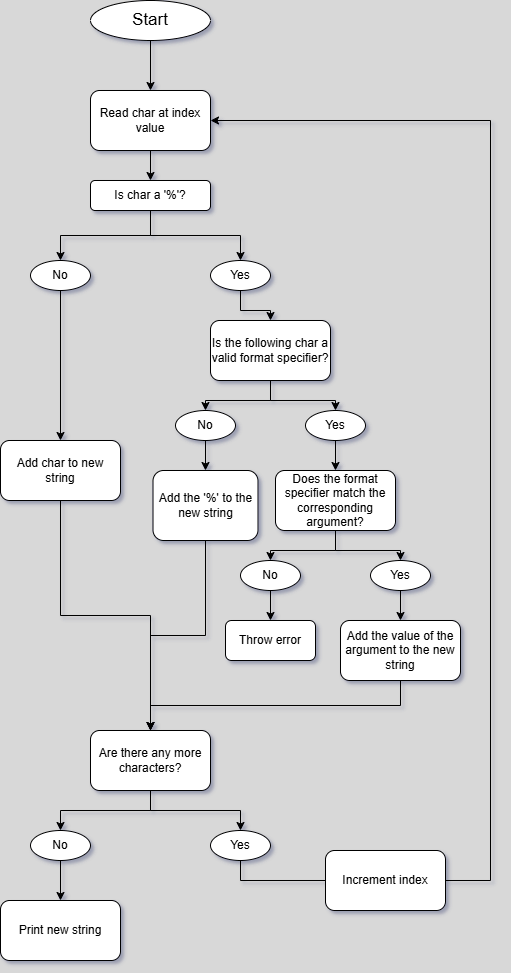

# Custom printf

This project recreates the `printf()` function from the C standard library. It demonstrates and tests custom formatting logic and can be used independently in other C programs.

## Features

- Supports `%c`, `%s`, `%d`, `%b`, `%%` format specifiers
- Builds output string manually before printing
## Flowchart



## How It Works

The `customPrint()` function first checks if the input string is `NULL`. If so, it prints an error and exits. Otherwise, it loops through the string character by character and builds a new output string.

When it encounters a `%` symbol, it checks the next character:
- If it's a valid format specifier, it converts the corresponding argument to a string and appends it.
- If it's not valid, it appends the `%` symbol to the new string.

After processing, the final string is passed to `printString()`, which prints each character to the terminal.

## Usage

Call `customPrint()` with a format string and corresponding arguments. Use `%s` for strings, `%c` for characters, and `%d` for integers.

Example:
```c
customPrint("Here's a string: %s. Here's a char: %c. Here's an integer: %d", "Hello, World!", 'c', 5);
```

## How to Run

### Compilation

Use GCC with the following command:

```bash
gcc -Wall -Werror -Wextra -pedantic -std=c11 -o program src/main.c src/custom_printf.c
```

### Execution
Run the compiled program file:

```bash
./program.exe
```

## Limitations

- Relies on `itoa()`. Since the `itoa()` function isn't a part of the C standard library, compatibility may vary across environments.
- Type checking and error handling is limited for format specifiers other than `%c` and `%%`.

## Authors

This project was made by Jerry Todd and Jonas Mast.